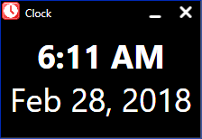
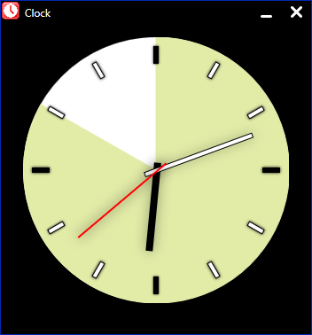
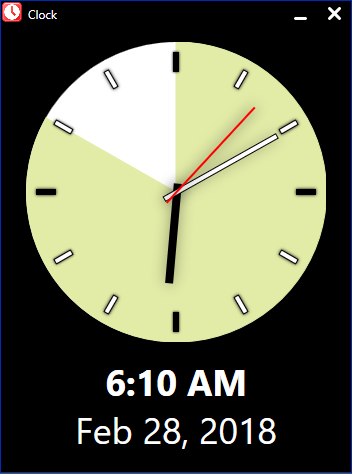

# Clock
Clock is a simple WPF analog/digital clock written in C#.
Clock has the following features.

* The analog clock features a sweeping second hand.
* Choice of analog or digital clocks or both.
* Choice to keep the window on top.
* Move clock by clicing and dragging anywhere within the window.
* Clock remembers your settings and restores them when starting again.

The clock face is drawn using WPF shapes and transforms, and shadowing
is used to give the clock face a subtle 3d appearance. In order to
have complete control over the appearance of the main window the window
is drawn without the normal Windows frame and buttons and menus are
used to simulate the system window and the minimize and close buttons.

Below are several snapshots of Clock with various options set.

All of the options are available by right clicking anywhere within the window
to open the window's context menu.

The window can be closed or minimized by clicking on the close or minimize buttons in
in the upper right of the window, from within the context menu, or from within the
simulated system menu.

